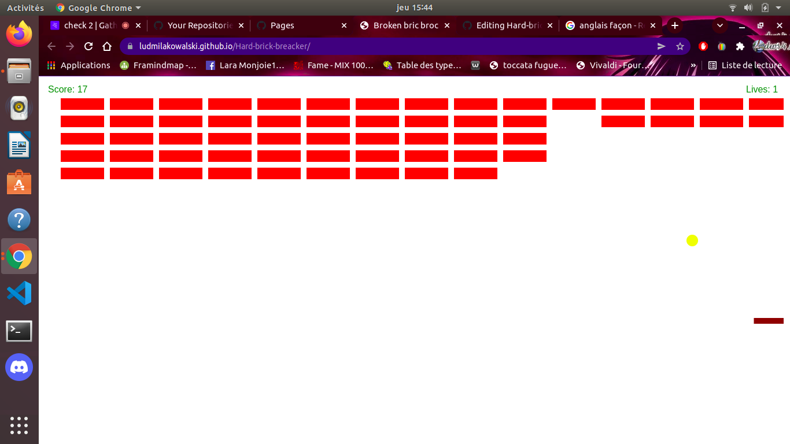
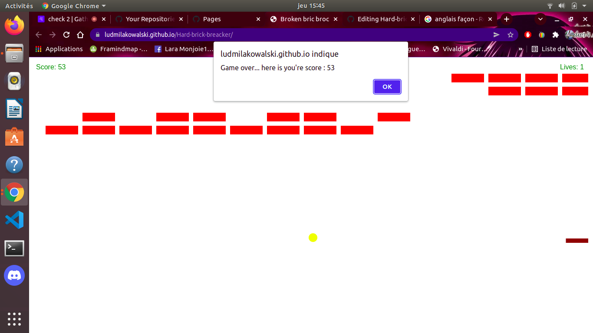

# Hard-brick-breacker-additional exercice

## Instruction

I decided to make a little brik breaker in Javascript for exercice myself with Javascript. This version is most difficult than the first one.

## Techno

I used, html for the base, css for customise and Javascript for running the game.

## The web site

This is a screenshot during a game :

This is a screenshot after you loose the game :

## Link

https://ludmilakowalski.github.io/Hard-brick-breacker/
